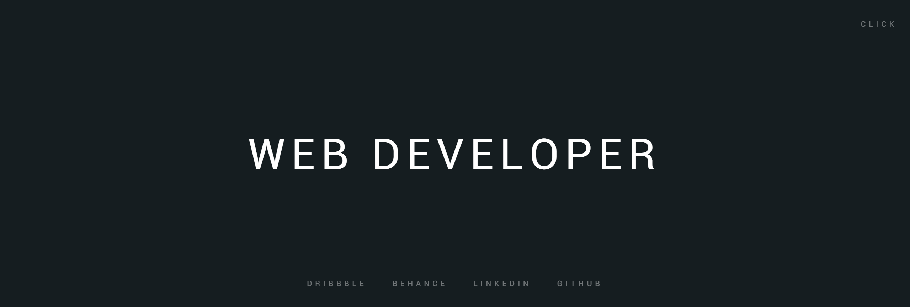

# FMCalisto Project Web Repository Homepage



This repository contains a custom homepage made using *Jade* (**HTML**), *Stylus* (**CSS**) and *CoffeeScript* (**JavaScript**). Feel free to download and modify. Comments and suggestions appreciated. Please don't expect too much.

## Source

* [Page Link](http://fmcalisto.com/)
* [Author Professional Homepage](http://franciscocalisto.me/)
* [Author Academic Homepage](http://web.tecnico.ulisboa.pt/francisco.calisto/)

Customizing
----
To change current theme, replace its name in [index.html](index.html)

To customize Bg colors theme links, modify the array in [js/home.js](js/home.js):

```javascript
# Bg colors
mainBgColor = "#151D20"
dribbbleBgColor = "#EA4C89"
behanceBgColor = "#005CFF"
linkedinBgColor = "#0085AF"
githubBgColor = "#181818"
```

To make new theme, you can copy an existing one, and change the file [css/home.css](css/home.css) as you like.

Please note that entries in your theme's [home.js](js/home.js) should match with contents of [js/](js/) directory as well as [home.css](css/home.css) should match with contents of [css/](css/).

(Of course, above links use `fmcalisto` theme only as an example.)

#### Acknowledgements

Oleg Frolov ([@Volorf](http://codepen.io/Volorf/))
